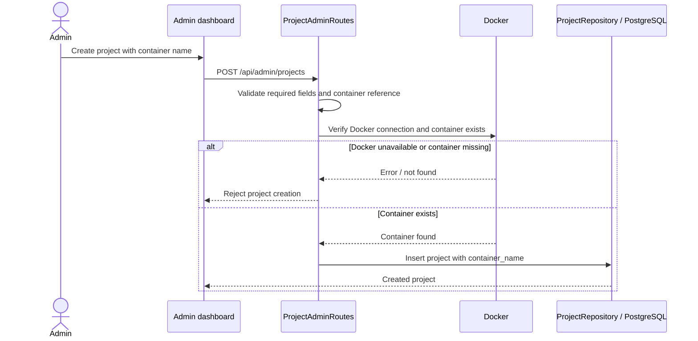
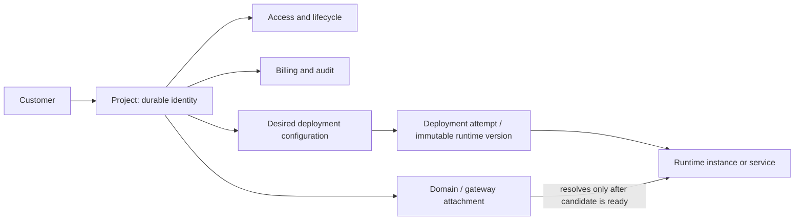

# Core Remodeling — Phase 0 Baseline

This document records the current code-level compatibility baseline for the [core remodeling plan](core-remodeling-plan.md). It is intentionally an inventory, not a schema proposal or migration. File and behavior references describe the repository at the time of this review; verify them again before Phase 1 implementation.

## Summary

The repository already separates customers from projects and has durable deployment configuration and execution records. Runtime identity and ownership are nevertheless still container/slug centered in important paths:

- Project creation requires an existing Docker container.
- Projects retain a required `container_name` and project-level image/source fields.
- Deployment configuration, execution, and compatibility job records use `project_slug`; deployments are created without validating a stable project foreign key.
- The worker uses the slug for per-project locking and synchronizes the resulting container name back to the project.
- Sites have a project foreign key, but a unique constraint allows only one site per project; Docker-discovery sites retain a container name.
- A candidate using an already-published host port cannot run alongside the old container. Current replacement stops and deletes the old runtime before candidate health succeeds, then attempts rollback on failure.

The broad Phase 0 consumer inventory is in the matrices below. What cannot be established from source alone is the deployed database's actual rows, orphan counts, active runtime mapping, client/API usage beyond checked-in frontend code, and current production migration history. Those require read-only production queries and operational evidence before a data migration is designed.

The deployment ownership report is available as the operational command `deployment-ownership-report`. Run it against a sanitized production copy after applying the additive ownership migration. By default it uses a read-only connection and prints counts by table for uniquely resolved, null slug, missing project slug, archived project, and ambiguous slug; it performs no writes and omits slug values from output. After reviewing the dry-run counts, `deployment-ownership-report --apply` backfills only uniquely resolved, non-archived rows with null `project_id`, in committed batches of 500. The command prints the counts again afterward and logs unresolved deployment row IDs, categories, and slugs for manual repair. It never infers ownership from runtime or customer fields.

## Consumer and compatibility matrix

| Concern | Current representation / behavior | Read and write consumers | Phase 1 compatibility implication |
|---|---|---|---|
| Project identity and runtime | `projects.id` and unique `slug` identify the durable project; required `container_name` identifies/configures runtime. GitHub repository/ref, image name/tag, and auto-deploy also live on project. | `Projects.kt`, `ProjectRepository.kt`; project admin routes and DTOs; nginx admin/backfill/operations; deployment worker and GitHub webhook; project dashboard. | Keep slug and legacy runtime fields readable while stable deployment ownership is introduced. Creation and editing currently validate Docker availability. |
| Project create/update API | `POST /api/admin/projects` requires slug, name, domain, and containerName, validates the referenced container exists, then inserts project. Updating `containerName` repeats Docker validation. | `ProjectAdminRoutes.kt`; frontend project create/detail flows. | Existing frontend and scripts depend on container-first request shape unless separately migrated. No-runtime creation is currently rejected. |
| Deployment intent/configuration | `deployment_configurations` stores editable image/runtime settings plus nullable `project_slug`; it has no `project_id` FK or environment key. | `DeploymentJobRepository.updateConfiguration`, create and redeploy routes; frontend deployment settings panel. | Configuration lookup/redeploy is by UUID; project association uses slug. Existing data needs slug-to-project resolution and orphan reporting. |
| Deployment attempt/history | `deployment_executions` is documented as an immutable snapshot plus mutable worker output, but carries nullable `project_slug`; create copies settings and secrets from request. | `DeploymentJobRepository.create/update/claimNext`; deployment admin list/detail/audit; frontend deployment history. | Do not assume snapshots are immutable in all fields: worker status/log/output are intentionally mutable, and configuration edits update compatibility job/config rows. Define immutable-vs-operational columns explicitly. |
| Legacy deployment job | `deployment_jobs` duplicates configuration and worker state. Repository writes/updates jobs and executions together; comments say the legacy row remains for worker compatibility. V22 backfills configuration/execution records from existing jobs. | `DeploymentJobRepository` is the active worker/API source; deployment worker; admin routes and frontend. | Migration must account for three synchronized representations and preserve IDs/status/history; determine whether any external consumer reads the raw table. |
| Deployment targeting and synchronization | Worker chooses job `container_name`, else looks up project by `project_slug`, else generates a name. On success it calls `ProjectRepository.syncDeployment(slug, containerName, commit)`, updating the project container field and writing an audit entry. | `DeploymentWorker.kt`, `ProjectRepository.kt`; GitHub webhook deployment target lookup. | Slug is still a runtime join key. Stable project FK must become authoritative before any slug compatibility is retired. |
| Safe replacement | Worker builds/pushes/pulls image, finds old runtime, records previous name/image, stops and deletes old runtime, creates candidate, waits up to 30 seconds for running/TCP health, then renames candidate. Failure removes candidate; code does not restore the old runtime in this worker catch path. | `DeploymentWorker.processClaimedJob`, `awaitHealthy`; project state sync and deployment status. | Target invariant “failed candidate leaves old runtime serving” is not currently met for ordinary replacement. Port-sharing makes true overlap impossible with current host-port model; resolve strategy before claiming this invariant. |
| Rollback | Rollback is an explicit endpoint/action for a successful job with `previousImage`. It stops current target, starts prior image with job runtime settings, checks health, and renames; it attempts to restart current target on failure. It does not create a new deployment record representing the rollback. | `DeploymentWorker.rollback`, deployment admin route, frontend deployment history. | Preserve this operational behavior during transition, but its history semantics and source of rollback runtime/configuration need definition. |
| GitHub auto-deploy | Projects map repository/ref/image/tag/autoDeploy. Webhook finds targets from project rows and creates a deployment request carrying `projectSlug` and the project's container name. | `ProjectRepository.findAutoDeployTargets`, GitHub webhook route, project detail settings UI. | Keep project-level source defaults compatible while deployment configuration moves to stable project ownership. |
| Site/domain | `sites.project_id` references project and is unique; site stores domain, upstream mode, optional upstream container or explicit port, TLS/certificate/gating/config/reconciliation fields. Site desired config is persisted separately from nginx files. | `Sites.kt`, `SiteRepository`, nginx admin routes, operations dashboard, nginx service/reconciler, frontend Nginx pages. | Existing cardinality is at most one site per project. Multiple domains require removing/changing this constraint later; do not assume current rows are one-to-many already. |
| Site upstream resolution | Docker-discovery checks/uses `upstream_container_name`. Explicit-port mode stores host/port. Project container name is used in project-based nginx wizard/backfill paths. | `NginxAdminRoutes.kt`, `NginxReconciliationService.kt`, `NginxBackfillRunner.kt`, nginx render/service classes. | Deployment cutover will need a resolver from project to active runtime. Preserve explicit-port developer-hosted sites and current config rendering during rollout. |
| Nginx backfill | Manual `backfill` operational command scans `sites-available`, matches filename to project slug, parses one proxy port/domain/TLS/cert, infers Docker mode only when port matches the discovered container's sole published host port, writes site and compares rendered bytes. It can run dry. | `Application.operationalCommand`, `NginxBackfillRunner`, `NginxSiteBackfill`. | It is not a general site import: unmatched files are skipped and ambiguous/unparseable configs fail. Production file inventory and dry-run report are needed before any backfill or cardinality change. |
| Gateway reconciliation | Reconciler maps files to sites by project slug, runs global nginx test, compares generated and available file hashes, checks symlink enablement and Docker health, and persists site reconciliation state. | `NginxReconciliationService` and admin/operations routes. | Routing and gateway status are independent in tables, but the existing site's upstream may still directly name a container. Keep access/business state separate from reconciliation status. |
| Access/lifecycle | Project `status`/`block_reason`, `deployment_mode`, `service_mode`, and `lifecycle_status` are separate columns. AutoBlocker changes status based on overdue billing; deployment worker does not intentionally set these business fields. | `ProjectRepository`, project admin routes, `AutoBlockerJob`, gate routes, dashboard project detail. | Preserve these distinctions. The allowed state transitions are only partly centralized/documented; lifecycle vocabulary needs a separate decision before enforcement. |
| Customer and financial history | Projects have nullable `customer_id`; payments, adjustments, audit and related records use project UUID references. | Customer/project/payment repositories and APIs; dashboard customer/project/payment pages; Scribed integration. | Stable project identity must remain unchanged so customer and financial history survive deployment refactors. |
| Credentials | Registry username/password are stored in registry credential records; application secret environment maps are encrypted in config/job/execution rows. Deployment API masks secret keys on reads; worker decrypts values for runtime and redacts logs/errors. | `RegistryCredentialRepository`, `SecretValueCipher`, deployment routes/repository/worker, registry settings UI. | There is no unified credential-set/version model. Do not migrate plaintext exposure; production encryption-key availability and ciphertext counts must be verified before data operations. |
| Dashboard/API consumers | Checked-in frontend has a deployment wizard/history page, project creation/detail tabs, operations and nginx pages. Deployment payload uses repository/ref/image/runtime and optional `projectSlug`; project creation flow includes container. | `/home/mike/Development/gatekeeperd-frontend/src/features/deployments/DeploymentsPage.tsx`, `projects/ProjectDetailPage.tsx`, `projects/ProjectsTable.tsx`, nginx and operations features. | Frontend is a separate repo and should be versioned/deployed compatibly. Also inventory scripts, MCP tools, and deployed clients; they are not proven absent by this source scan. |

## Current flow diagrams

### Container-first project creation

### Current deployment replacement and rollback

```mermaid
stateDiagram-v2
    [*] --> Queued
    Queued --> Running: worker claims job
    Running --> BuildPushPull: clone, build, push, pull
    BuildPushPull --> LocateOldRuntime
    LocateOldRuntime --> StopAndDeleteOld: same published host port
    LocateOldRuntime --> StartCandidate: no old runtime / no port conflict
    StopAndDeleteOld --> StartCandidate
    StartCandidate --> HealthCheck
    HealthCheck --> Succeeded: running and TCP probe passes
    HealthCheck --> Failed: timeout / exception
    Failed --> CandidateRemoved: cleanup candidate
    CandidateRemoved --> OldRuntimeRestoreAttempt: rollback path where applicable
    Succeeded --> ProjectContainerFieldSynced
    Succeeded --> RollbackAvailable: previous image recorded
    RollbackAvailable --> RollbackCandidate
    RollbackCandidate --> Succeeded: prior image passes health check
    RollbackCandidate --> RollbackFailed: candidate fails; current restart attempted
```

**Safety clarification:** the diagram captures the normal code path, but not a guarantee that the old runtime remains serving. In the host-port replacement path it is stopped and deleted before candidate health checks; the worker's general failure handler only removes the candidate. The explicit rollback endpoint can restore a previous image when invoked and when recorded data is sufficient. Phase 2 must not claim zero-downtime or automatic old-runtime preservation until the port/routing design implements and verifies it.

### Target ownership and cutover invariants

Required target invariants (not all true today):

1. Project exists without a deployment or container.
2. At most one deployment is active per project and environment.
3. A failed candidate does not replace or remove the active deployment/runtime.
4. Gateway routing changes only after candidate readiness and gateway validation succeed.
5. Project access/lifecycle/billing do not derive from runtime health or deployment status.
6. Rollback is a new auditable transition and retains the failed/superseded history.
7. Secret plaintext is not returned, logged, or copied into deployment history.

## Database baseline and compatibility cautions

- `Projects.container_name` is `NOT NULL`; project creation and repository records require it. Project image/repository fields are nullable/defaulted columns on the same row.
- `deployment_configurations`, `deployment_executions`, and `deployment_jobs` currently have no stable project FK or environment key. All three carry slug or runtime fields; the execution/config rows are populated from jobs by the V22 migration.
- The site table has a unique project FK and runtime upstream columns. A future multi-domain model needs an additive constraint/data rollout.
- This repository has a consolidated `V1__current_schema.sql` containing the current migration history's SQL. Never edit SQL already recorded as applied. New changes must use the repository's configured Flyway versioning convention; inspect Flyway history on the target database first.
- Source inspection does not establish production row counts, duplicate/orphan slug references, whether slugs have been renamed, DB constraints actually applied, environment-specific drift, the exact active container per project, or active jobs during rollout.

## Production data facts required before Phase 1

Collect read-only reports from the target database and host before defining backfills. Do not put secret values or customer PII into committed reports.

| Question | Read-only fact to collect | Why it matters |
|---|---|---|
| Which schema is deployed? | Flyway schema-history versions/checksums, table/column/constraint/index inventory. | Confirms actual schema and whether the consolidated migration was applied as expected. |
| How many projects rely on runtime fields? | Counts of active/archived projects; null/blank/duplicate container refs; image/source configuration coverage. | Determines whether compatibility defaults or manual repair are needed. |
| Can deployment slugs resolve? | Counts of config, execution, and job rows with null/unmatched `project_slug`; rows whose slug resolves to archived projects; duplicate deployment configurations per slug. | Shapes stable-FK backfill and orphan handling. |
| What deployment history exists? | Counts by table/status; job-to-config/execution ID mismatches; missing snapshots; succeeded jobs with/without commit, digest, previous image/runtime. | Tells us whether historical deployment rows can be linked and which history is incomplete. |
| What runtime is active? | Read-only Docker inventory mapped to project container names, labels, host ports, images/digests and health; compare with DB. | Project fields alone may be stale; never infer business project identity from container name alone. |
| What do site records reference? | Site count, project FK consistency, per-project cardinality, modes, container references, explicit ports; compare with `sites-available`/`sites-enabled` names and rendered domains. | Determines gateway resolver/backfill compatibility and unmapped files. |
| What is the migration window? | Active deployment jobs, webhook deliveries/auto-deploy activity, worker count and maintenance/restart constraints. | Prevents ownership backfill racing with deployment writes. |
| Which consumers exist outside checked-in code? | Deployed frontend version, admin scripts, API clients, MCP tools and automation payload examples. | Defines compatibility window before old fields/endpoints can be retired. |

**Backfill rules:** resolve by existing project slug only when it maps uniquely to a project ID; report null/unmatched/ambiguous rows for operator repair; do not guess from container name, domain, image, or customer name. Preserve job/execution IDs and timestamps. Dry-run and emit counts plus row identifiers first; apply in resumable/idempotent batches; verify before enforcing constraints.

## Phase 0 exit checklist

- [x] Repository consumers for project container/image fields, deployment tables/slugs, and site ownership identified.
- [x] Current project creation, deployment, replacement, failure, rollback, and nginx backfill behavior documented.
- [x] Target invariants and current gaps separated explicitly.
- [x] Production data shape and external consumers identified as facts that source review cannot supply; report requirements and conservative backfill rules documented.
- [x] No schema or production data changes made in this phase.

Phase 0 is complete for the **code/documentation baseline**. The data-shape portion of the Phase 1 preflight remains pending until the read-only production reports above are collected. No destructive migration is proposed by this phase.
